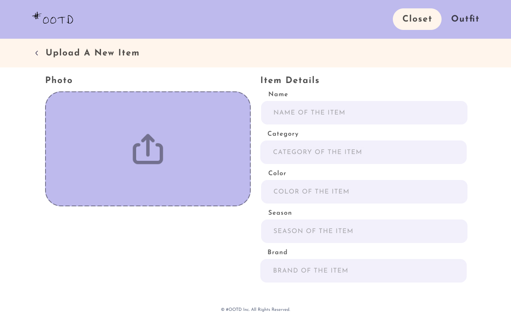
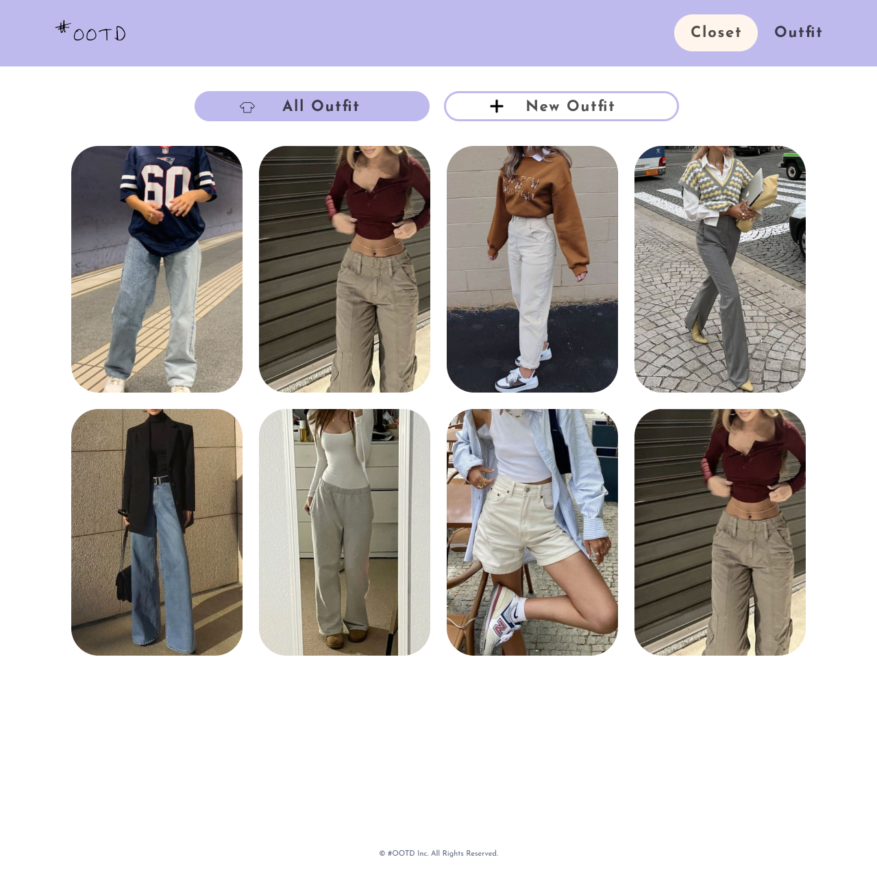
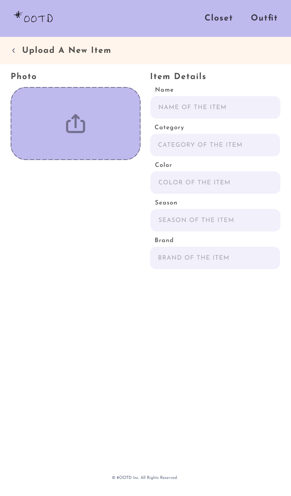
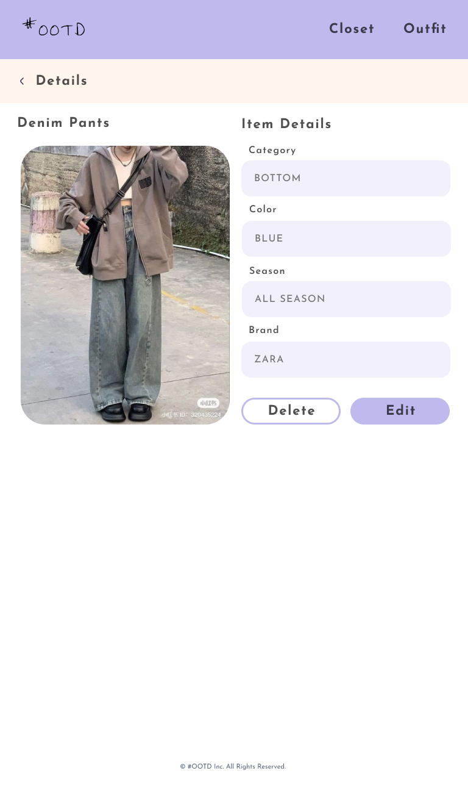
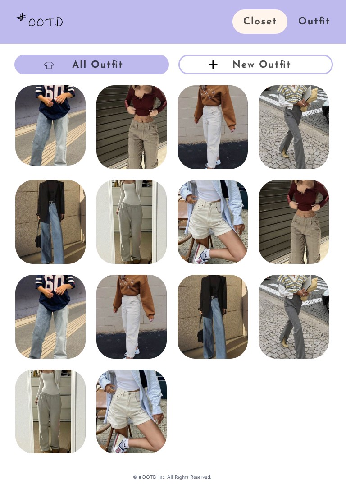
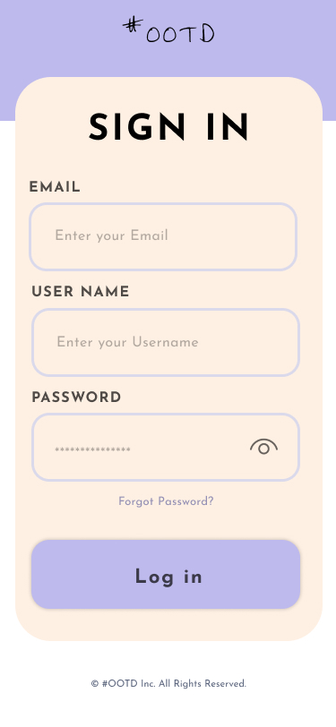
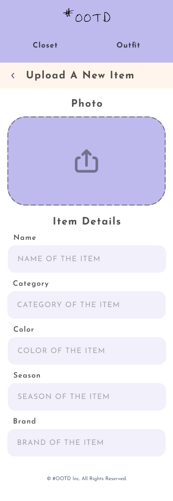
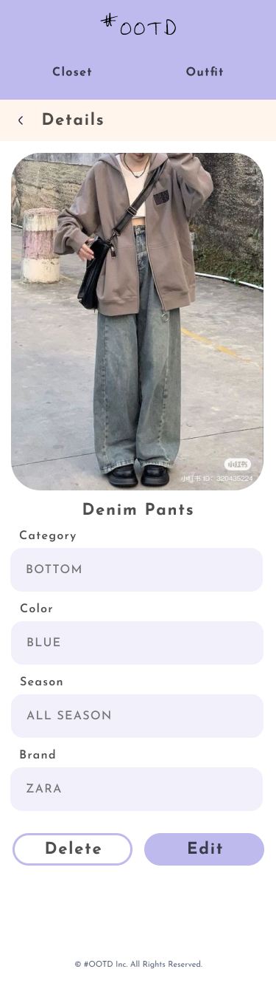
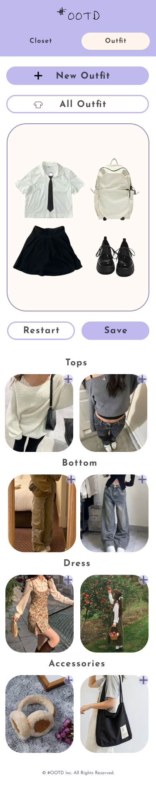

# Irene Zeng_Capstone_#OOTD

## Overview
This project aims to deliver a simple yet effective web application, focusing on helping users organize their wardrobe and plan their outfits efficiently.

### Problem
-   HMW help people to **organize their wardrobe** in a more efficient way?
-   HMW help user to **plan their outfit** with less efforts? 

### User Profile
-   **Fashion Enthusiasts:** People who love fashion and want to keep track of their wardrobe items efficiently.
-   **Busy Professionals:** Users who need to quickly plan outfits for various occasions.
-   **Students:** Individuals looking for a quick and easy way to organize their clothes and plan daily outfits.

### Features
-   **Add Items:** Users can add items to their wardrobe, including photo uploads and details like category, color, brand, and season.
-   **Edit Items:** Users can edit the details of existing wardrobe items.
-   **Delete Items:** Users can remove items from their wardrobe.  
- **Outfit Creation:** Users can create and save outfits by combining different wardrobe items.

## Implementation

### Tech Stack
-   **Frontend:**
    -   React: For building the user interface.
    -   HTML/CSS: For the structure and styling of the web app.
    -   JavaScript: For interactive features and dynamic content updates.
-   **Backend:**
    -   Node.js/Express: For handling server-side operations and API endpoints.
    -   JSON File: To store wardrobe and outfit data.

### APIs
No external APIs will be used for this project. All data will be stored locally using JSON files.

### Sitemap
-   **Login Page:** User login. (Nice to have: Authentication).
-   **Upload Page:** Page to add new wardrobe items, including photo uploads and item details.
-   **Closet Page:** Displays all wardrobe items, with options to add items. (Nice to have: sort items)
-   **Details Page:** Detailed view of a specific wardrobe item, with options to edit items. (Nice to have: delete items)
-   **Outfit Gallery:** Canvas for styling and saving outfits (Nice to have: Canvas to style freely).

### Mockups

Nice to have - resposive design:

### Data
There will be no database, but a JSON file will include the data needed for this project. Potential data structure below:

#### Closet:
`[
  {
    "id": 1,
    "itemName": "Blue Shirt",
    "image": "url_to_image",
    "category": "Top",
    "color": "Blue",
    "season": "Summer",
    "brand": "Brand A"
  }
  ...
]` 

### Endpoints
-   **GET /items** Retrieve a list of all wardrobe items.
-   **GET /items/:id** Retrieve a single wardrobe items.
-   **POST /items:** Add a new item to the wardrobe.
-   **PUT /items/:id** Update the details of an existing item.
-   **DELETE /items/:id** Remove an item from the wardrobe. (Nice to have)

### Auth
Simple username/password just to mimic the user experiece, directely navigate to Homepage. 
(Nice to have: Authentication).

## Roadmap

## Nice-to-haves

- **Responsive Design:** implement responsive design when possible
- **Delete Item:** deleting will be a feature to implement if time permits.
- **Category Sorting:** Users can sort items by categories such as tops, bottoms, accessories, etc.
- **Authentication:** Implement Auth if time permits.
- **Outfit Calendar:** Users can plan and schedule outfits for specific days using a calendar interface.